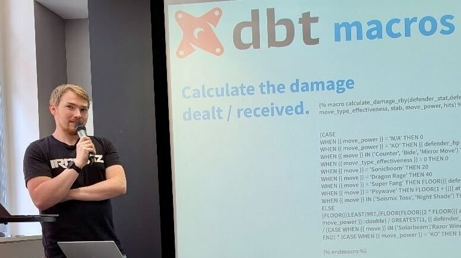

<!--img src='https://avatars.githubusercontent.com/u/34423757?v=4' width="20%"-->

# Hey, I'm Will 👋

<h3>
  <b>An Expert In Analytics 📈</b> 
  <i>That Makes Data Work for You</i>
</h3>
I develop solutions that are:

- **Engaging Visualisations** of raw data that deliver insight and prompt decision-making, using Tableau  
- **Engineered Data Applications** that actually meet users’ needs, with SQL, Python & AI  
- **Practical Training & Tutorials** to upskill teams through in-person sessions, YouTube and blogs

## ⭐ A World Champion in Data Visualisation

Since 2013, I've been hooked on building data visualisations with Tableau.  This passion has led to several career highlights:
  - Saved the BBC over £400k with one chart detailing the outcome of a planned project
  - Demonstrated the value of Data Science attribution models to WorldRemit stakeholders
  - Upskilled and enabled new and existing users at The Information Lab

In 2022, I travelled to Las Vegas to compete in the largest data visualisation contest globally, Tableau's Iron Viz competition. The final round involved presenting a 20-minute Tableau dashboard before a live audience of 5,000 and a global streaming audience.

Currently I am a [Tableau Visionary](https://www.tableau.com/community/community-leaders/visionaries), [Tableau Ambassador](https://www.tableau.com/community/community-leaders/ambassadors), Co-host of the [GamesNightViz Community Project](https://gamesnightviz.webflow.io/), Leader of the [AI + Tableau User Group](https://usergroups.tableau.com/ai-tableau-user-group/), and [2022 Iron Viz Champion](https://www.tableau.com/blog/iron-viz-2022-championship).

Below are some highlighted projects from my [Tableau Public Profile](https://public.tableau.com/app/profile/wjsutton/vizzes#!/)

  
  
  

  
  
  
  

  
  
  
  

## Engineered Data Applications

Over the last few years, I’ve been keen not only to understand what AI can do but also to build genuinely useful applications. While AI has opened many new opportunities and quick ways to get started, there is still immense value in a well-engineered data pipeline that delivers on stakeholder requirements.

- **Chat with your data** on Tableau Server using the [Tableau MCP Starter Kit](https://github.com/TheInformationLab/tableau_mcp_starter_kit)  
- **Ace Tableau’s Data Analyst exam** with my custom OpenAI GPT: [Tableau Certified DA GPT](https://github.com/wjsutton/tableau_certified_da_gpt)  
- **Master dbt transformations** in my “flawless victory” project: [Pokemon Yellow Legacy](https://github.com/wjsutton/pkmn_yellow_legacy_dbt)  

## Practical Training and Tutorials

I design and deliver training that’s practical and built for working analysts. Recently, these have focused on addressing the emerging data engineering skills gap and opportunities within The Information Lab.

I run internal training for data engineering consultants and host public in-person dbt training days. I also share walkthroughs of data challenges on GitHub and YouTube, aiming to make tooling and techniques more accessible for analysts looking to grow their skillset.

Here are some of my materials that I compiled for internal and external training, often coming with video walkthroughs of not just giving an answer but explaining why and discussing various techniques to solve the problem.
- [Spill the dbt](https://github.com/wjsutton/spill_the_dbt) 
- [The Summer of SQL](https://github.com/wjsutton/the_summer_of_sql)
- [Python Charmers](https://github.com/wjsutton/python_charmers) 

## Career Timeline, Sep 2007 - Dec 2025

12 Years in Data & Analytics

Sectors: 7 Years in Finance, 4.5 Years in Media & Broadcast, 3.5 Years in Consulting | Full details available on [LinkedIn](https://www.linkedin.com/in/will-sutton-14711627/)

### Certifications

## Do You Want My Help?

I'm available for data analytics consulting projects via [The Information Lab](https://www.theinformationlab.co.uk/). 

You can speak to your Account Manager or contact the team directly through the [website](https://www.theinformationlab.co.uk/).  

 
 

Otherwise, stay up to date with my latest projects on the following social media sites:
 

  
  &nbsp;&nbsp;&nbsp;&nbsp;
  
  &nbsp;&nbsp;&nbsp;&nbsp;
  
  &nbsp;&nbsp;&nbsp;&nbsp;
  
  &nbsp;&nbsp;&nbsp;&nbsp;
  

