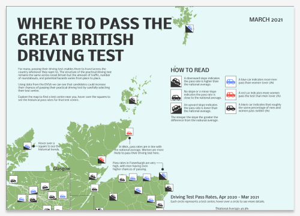
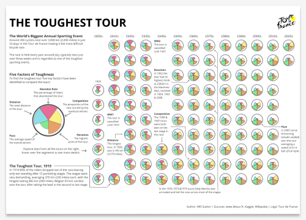
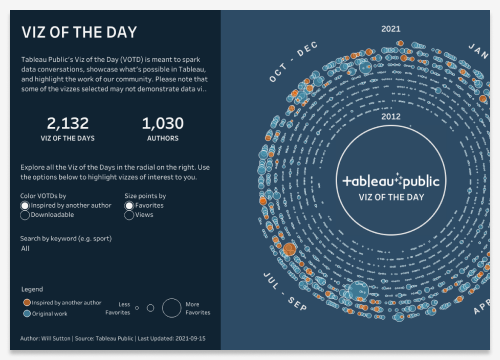
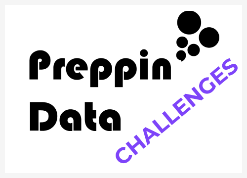

<!--img src='https://avatars.githubusercontent.com/u/34423757?v=4' width="20%"-->

# Will Sutton
**Consultant at The Information Lab | London, United Kingdom**  
I've been working with data for over 10 years and now work as a Senior Data Analyst using data to help inform business decisions. 

I owe a large amount of my career development down to passion projects; either part of the Tableau community, producing insights for my running club, or questions I wanted to know the answers to. 

Below you'll find some of my favourite projects highlighted with documentation here on [GitHub](https://github.com/wjsutton), and many becoming data visualisations for my [Tableau Public Profile](https://public.tableau.com/app/profile/wjsutton) 

<!--img src = "https://media.giphy.com/media/US1gFtWV9oomA2qPmg/giphy.gif" width="90%"-->

## ⭐ Community Project: #GamesNightViz

Data visualisation, design and data prep challenges using data from games.

  

## ⭐ Data Viz Projects

## ⭐ Coding Projects

- [Building a gallery of Iron Viz submissions from Twitter for easy discovery & consumption](https://github.com/wjsutton/ironviz_2020_gallery)
- [Reducing lockdown boredom with an on-demand quiz based on the TV show House of Games](https://github.com/wjsutton/house_of_games)
- [Preserving my data from Halo 2 & 3 online matches](https://github.com/wjsutton/halostats)

<strong>🔨 Tools I've built for faster data analysis</strong> 

- [Faster data viz with a gallery of R ggplot2 templates](https://github.com/wjsutton/ggplot2_snippets)
- [Automated data analysis and data quality reporting with R](https://github.com/wjsutton/data_profiler)
- [Reproducible coding with a collection of useful R functions](https://github.com/wjsutton/useful_r_functions)

<strong>📫 Where to contact me</strong>

- [Twitter][Twitter] :speech_balloon:
- [LinkedIn][LinkedIn] :necktie:
- [Website][Website] :link:

<!--
Quick Link 
-->

[Twitter]:https://twitter.com/WJSutton12
[LinkedIn]:https://www.linkedin.com/in/will-sutton-14711627/
[GitHub]:https://github.com/wjsutton
[Website]:https://wjsutton.github.io/

<!--
**wjsutton/wjsutton** is a ✨ _special_ ✨ repository because its `README.md` (this file) appears on your GitHub profile.

Here are some ideas to get you started:

- 🔭 I’m currently working on ...
- 🌱 I’m currently learning ...
- 👯 I’m looking to collaborate on ...
- 🤔 I’m looking for help with ...
- 💬 Ask me about ...
- 📫 How to reach me: ...
- 😄 Pronouns: ...
- ⚡ Fun fact: ...
-->
